# Projeto de Pizzaria - UNIP CAMPUS RANGEL
Repositório responsável por armazenar os códigos de um projeto de PIM (Projeto Integrado Multidisciplinar) desenvolvido em C++(Console), onde o Administrador tem controle sobre as entradas de pedidos e saídas de ingredientes utilizados nos pedidos.
Segue abaixo algumas das funções mais importantes do sistema.

<h3>Selecionar Filial</h3>
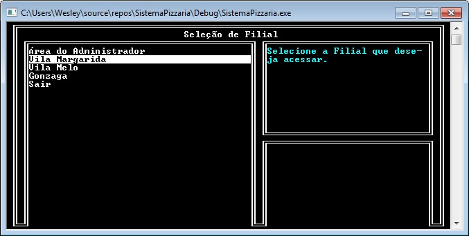

A seleção de filial tem o objetivo de controlar corretamente os produtos e vendas de cada filial cadastrada no sistema.

<h3>Área do Administrador</h3>
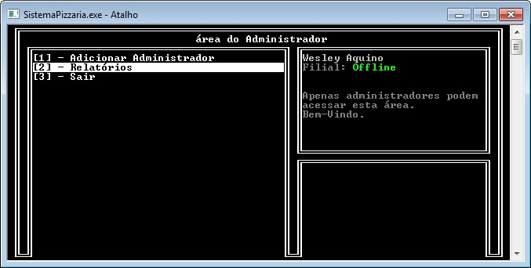

Na Área do Administrador, o usuário pode adicionar um novo funcionário, dando assim ao mesmo total acesso as funcionalidades do sistema.

<h3>Menu de Seleção</h3>
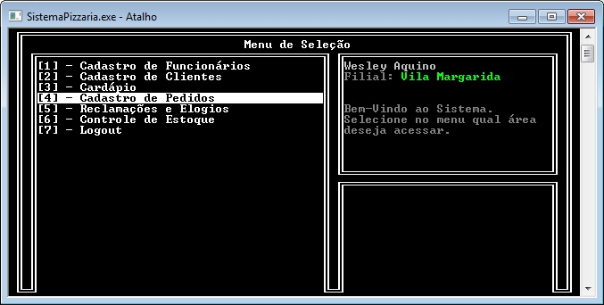

Na área do Menu de Seleção, o funcionário -já logado- tem acesso as funções do sistema, sendo elas:
- Cadastro de Funcionários;
- Cadastro de Clientes;
- Cardápio;
- Cadastro de Pedidos;
- Reclamações e Elogios
- Controle de Estoque;
- Logout.

<h3>Cardápio</h3>
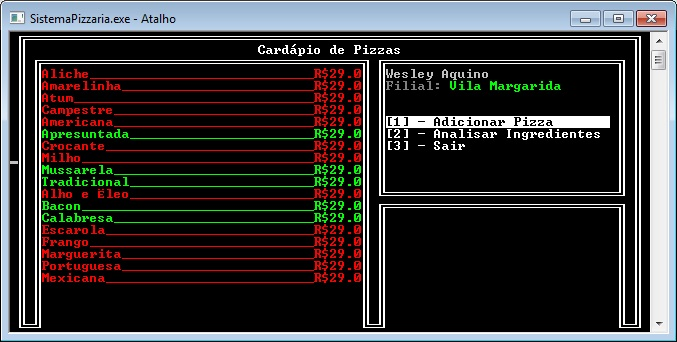

Para exibir as Pizzas disponíveis para a compra -baseado na quantidade de ingredientes-, temos a parte do Cardápio, onde o produto aparece na cor verde caso esteja disponível, e vermelho caso não esteja.

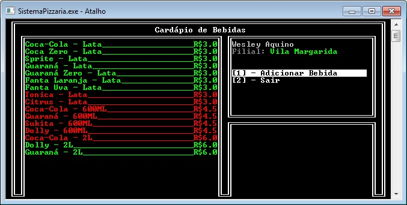

Temos também o cardápio de bebidas, cujo a funcionalidade é a mesma do cardápio de pizzas, com o diferencial de que para a bebida estar disponível basta ter no mínimo uma unidade dela no estoque.

<h3>Ingredientes das Pizzas</h3>
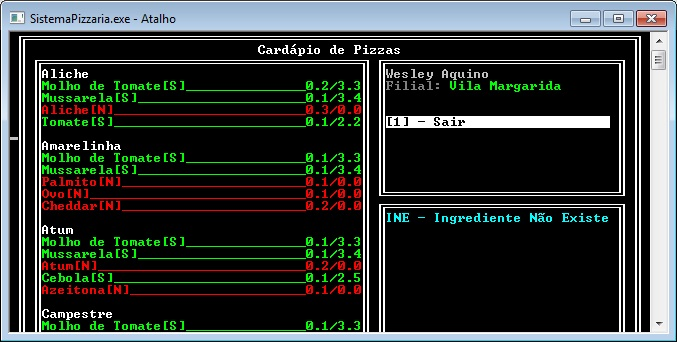

É possível também visualizar os ingredientes que compõe as pizzas, sabendo assim qual tem quantidade suficiente para a produção de uma unidade, e qual não tem.

<h3>Realizar Pedidos</h3>
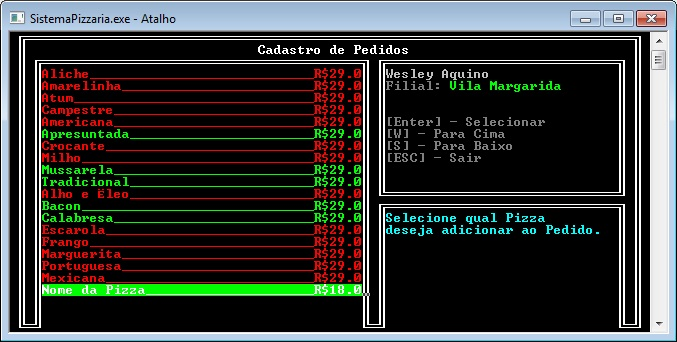

É possível selecionar os produtos que deseja adicionar ao pedido do cliente, tendo ao final o total, endereço e os produtos requisitados.
Sendo essa a funcionalidade mais importante do sistema, o administrador ou funcionário seleciona o produto e a quantidade desejada -respeitando o limite de produtos no estoque obrigatoriamente;
Enquanto o número aparece em verde, é possível selecionar o valor/quantidade. Caso contrário, o sistema não permitirá o avanço para o próximo passo.

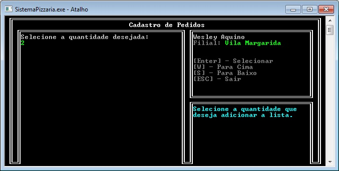

Ao finalizar o pedido, ele será gerado e irá para a tela de pedidos em aberto.

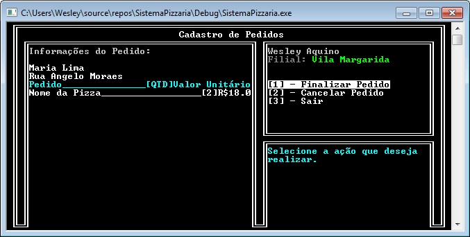

<h3>Estoque</h3>
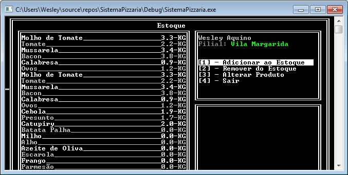

No estoque, temos acesso aos ingredientes disponíveis, podendo adicionar, remover, ou alterar a quantidade de ingredientes existentes.

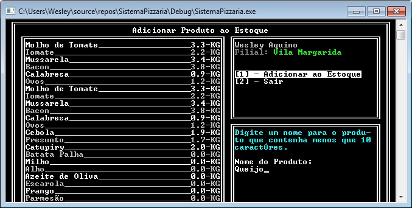

Pode-se adicionar um novo produto ao Estoque, sem repetir o nome do mesmo e incrementando a sua quantidade, tendo seu valor mínimo em zero.

O Objetivo do sistema seria facilitar a forma que o dono de uma pizzaria tem o controle de seus produtos emitidos, estoque, bebidas etc. 
O sistema conta com mais funcionalidades
